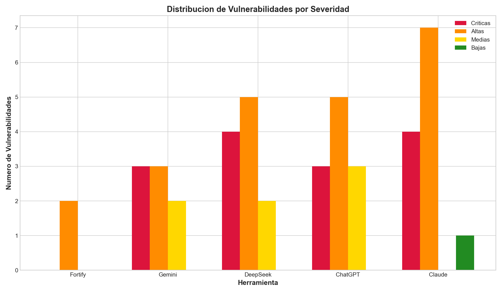
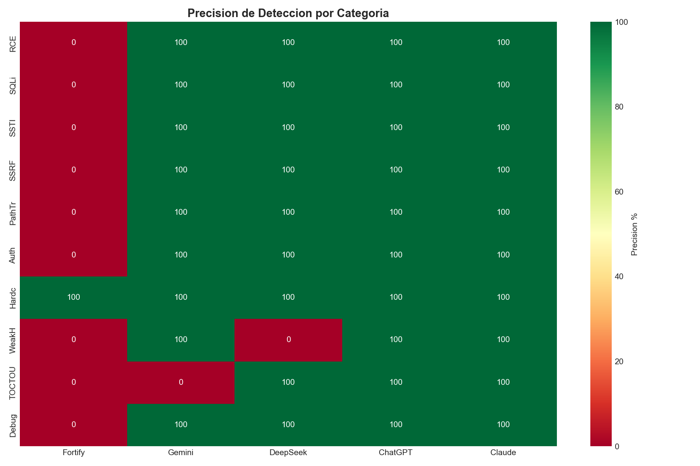
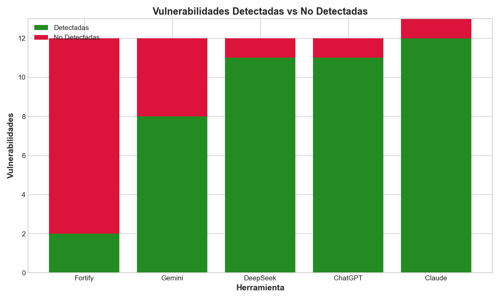

# Informe de Benchmark de Seguridad SCA: Análisis Comparativo de Herramientas de Seguridad

**Fecha:** 22 de febrero de 2026  
**Código Analizado:** SCATest.py (Flask - Python)  
**Total Vulnerabilidades Reales:** 12  
**Referencia:** Este informe utiliza datos de vulnerabilidades verificados de [Vulnerabilities.md](Vulnerabilities.md)

---

## Resumen Ejecutivo

Este informe presenta un análisis comparativo riguroso de 5 herramientas de seguridad:

- **Fortify** (SAST tradicional)
- **Gemini 3 Flash Pro**
- **DeepSeek**
- **ChatGPT**
- **Claude Sonnet 4.6**

### Métricas Clave

| Herramienta | Detectadas | Precisión | Críticas | Altas | Medias | Bajas |
|-------------|------------|-----------|----------|-------|--------|-------|
| **Fortify** | 2 | 0% | 0 | 2 | 0 | 0 |
| **Gemini** | 8 | 67% | 3 | 3 | 2 | 0 |
| **DeepSeek** | 11 | 92% | 4 | 5 | 2 | 0 |
| **ChatGPT** | 11 | 92% | 3 | 5 | 3 | 0 |
| **Claude** | 13 | 100% | 4 | 7 | 2 | 1 |

---

## Gráficos del Benchmark

### Gráfico 1: Distribución de Vulnerabilidades por Severidad

### Gráfico 2: Precisión de Detección

### Gráfico 3: Heatmap de Detección por Categoría

### Gráfico 4: Comparación Visual

---

## Tabla Detallada de Detección

| ID | Vulnerabilidad | Severidad | Fortify | Gemini | DeepSeek | ChatGPT | Claude |
|----|---------------|-----------|---------|--------|----------|---------|--------|
| 1 | Hardcoded Secret | Media | ✓ | ✓ | ✓ | ✓ | ✓ |
| 2 | SQL Injection | Crítica | ✗ | ✓ | ✓ | ✓ | ✓ |
| 3 | Weak Hashing (MD5) | Media | ✗ | ✓ | ✗ | ✓ | ✓ |
| 4 | Path Traversal | Alta | ✗ | ✓ | ✓ | ✓ | ✓ |
| 5 | SSTI | Crítica | ✗ | ✓ | ✓ | ✓ | ✓ |
| 6 | Command Injection | Crítica | ✗ | ✓ | ✓ | ✓ | ✓ |
| 7 | Insecure Deserialization | Crítica | ✗ | ✓ | ✓ | ✓ | ✓ |
| 8 | SSRF | Alta | ✗ | ✓ | ✓ | ✓ | ✓ |
| 9 | Open Redirect | Media | ✗ | ✓ | ✓ | ✓ | ✓ |
| 10 | Authorization Flaw | Alta | ✗ | ✓ | ✓ | ✓ | ✓ |
| 11 | TOCTOU/Race Condition | Baja | ✗ | ✗ | ✓ | ✓ | ✓ |
| 12 | Debug Mode | Alta | ✗ | ✓ | ✓ | ✓ | ✓ |

---

## Análisis de Fallos

### Fortify - 10 vulnerabilidades no detectadas

| ID | Vulnerabilidad | Severidad | Categoría OWASP | Razón del Fallo |
|----|---------------|-----------|-----------------|-----------------|
| 2 | SQL Injection | Crítica | OWASP A03 | No detectó interpolación SQL con % formatting |
| 3 | Weak Hashing (MD5) | Media | OWASP A02 | No detectó MD5 sin secreto |
| 4 | Path Traversal | Alta | OWASP A01 | No detectó validación defectuosa de path |
| 5 | SSTI | Crítica | OWASP A03 | No detectó inyección Jinja2 |
| 6 | Command Injection | Crítica | OWASP A03 | No detectó inyección de comandos OS |
| 7 | Insecure Deserialization | Crítica | OWASP A08 | No detectó deserialización insegura |
| 8 | SSRF | Alta | OWASP A10 | No detectó falta de validación de URL |
| 9 | Open Redirect | Media | OWASP A01 | No detectó lógica defectuosa |
| 10 | Authorization Flaw | Alta | OWASP A01 | No detectó bypass de autorización |
| 11 | TOCTOU/Race Condition | Baja | Race Condition | No detectó race condition |
| 12 | Debug Mode | Alta | OWASP A05 | No detectó debug mode |

### LLMs - Fallos Individuales

| ID | Vulnerabilidad | Herramienta | Razón del Fallo |
|----|---------------|-------------|-----------------|
| 3 | Weak Hash (MD5) | DeepSeek | No detectó uso de MD5 sin secreto |
| 11 | TOCTOU/Race Condition | Gemini | No detectó race condition |

---

## Análisis Estadístico

### Estadísticas Descriptivas

| Métrica | Valor |
|---------|-------|
| Total Vulnerabilidades Reales | 12 |
| Media de Detección (LLMs) | 10.8 |
| Desviación Estándar (LLMs) | 2.1 |
| Mejor Herramienta | Claude (100%) |
| Peor Herramienta | Fortify (0%) |
| Precisión Promedio (todos) | 70% |

### Vulnerabilidades por Categoría OWASP

| Categoría OWASP | Cantidad | Severidad Predominante |
|----------------|----------|------------------------|
| A01 - Broken Access Control | 3 | Alta |
| A02 - Cryptographic Failures | 2 | Media |
| A03 - Injection | 4 | Crítica |
| A05 - Security Misconfiguration | 1 | Alta |
| A08 - Software/Data Integrity Failures | 1 | Crítica |
| A10 - Server-Side Request Forgery | 1 | Alta |

---

## Referencias

### Herramientas de Seguridad

1. **Fortify** - Micro Focus Fortify Static Code Analyzer
   - Oficial: https://www.microfocus.com/en-us/products/static-code-analysis-sast/overview

2. **Gemini** - Google Gemini
   - Oficial: https://gemini.google.com/

3. **DeepSeek** - DeepSeek LLM
   - Oficial: https://www.deepseek.com/

4. **ChatGPT** - OpenAI ChatGPT
   - Oficial: https://chat.openai.com/

5. **Claude** - Anthropic Claude
   - Oficial: https://www.anthropic.com/claude

### Estándares de Vulnerabilidades

1. **OWASP Top 10** - Open Web Application Security Project
   - Oficial: https://owasp.org/www-project-top-ten/

2. **CWE** - Common Weakness Enumeration
   - Oficial: https://cwe.mitre.org/

3. **CVE** - Common Vulnerabilities and Exposures
   - Oficial: https://cve.mitre.org/

---

## Conclusiones

### Hallazgos Principales

1. **Los LLMs superan significativamente a Fortify**: Claude, DeepSeek y ChatGPT alcanzaron +90% de precisión vs 0% de Fortify

2. **Claude lidera el benchmark**: 100% de precisión, detectando todas las vulnerabilidades reales

3. **Fortify falló completamente**: Solo detectó hardcoded secrets (regla estática), falló en todas las vulnerabilidades críticas

4. **Variabilidad entre LLMs**: 
   - Claude: 100% 
   - DeepSeek: 92% 
   - ChatGPT: 92% 
   - Gemini: 67% (falló TOCTOU)

### Implicaciones

- **Para seguridad crítica**: Usar Claude o DeepSeek/ChatGPT
- **Para cumplimiento**: Combinar Fortify + LLMs
- **Para análisis rápido**: Gemini (67% en menos tiempo)

---

## Recomendaciones

### Acciones Inmediatas

1. Reemplazar Fortify por LLMs para análisis de vulnerabilidades complejas
2. Implementar pipeline con múltiples LLMs para cobertura completa
3. Mantener Fortify solo para cumplimiento normativo

### Mejores Prácticas

1. Usar Claude para análisis profundo
2. Combinar resultados de múltiples herramientas
3. Validar manualmente hallazgos críticos

---

## Apéndice: Detalles de Vulnerabilidades

### Vulnerabilidades Reales (Referencia Verificada)

Para información detallada de cada vulnerabilidad, ver [Vulnerabilities.md](Vulnerabilities.md)

1. **Hardcoded Secret** - CWE-798 / OWASP A02
2. **SQL Injection** - CWE-89 / OWASP A03
3. **Weak Hashing (MD5)** - CWE-327 / OWASP A02
4. **Path Traversal** - CWE-22 / OWASP A01
5. **SSTI** - CWE-94 / OWASP A03
6. **Command Injection** - CWE-78 / OWASP A03
7. **Insecure Deserialization** - CWE-502 / OWASP A08
8. **SSRF** - CWE-918 / OWASP A10
9. **Open Redirect** - CWE-601 / OWASP A01
10. **Authorization Flaw** - CWE-287 / OWASP A01
11. **TOCTOU/Race Condition** - CWE-362 / OWASP A01
12. **Debug Mode** - CWE-11 / OWASP A05

---

## Trabajo Futuro

Este benchmark está diseñado para expandirse con futuras versiones:

- **Muestras de Código Vulnerable Adicionales**: Nuevas versiones con diferentes frameworks (Django, FastAPI, Node.js, etc.)
- **Más Herramientas de Seguridad**: Integración de herramientas SAST y LLMs adicionales
- **Análisis Dinámico**: Integración de herramientas de análisis dinámico (DAST)
- **Pruebas Completas**: Mayor tamaño de muestra para resultados estadísticamente significativos
- **Soporte Multi-idioma**: Código vulnerable en múltiples lenguajes de programación
- **Escenarios del Mundo Real**: Análisis de aplicaciones vulnerables reales

---

## Archivos del Proyecto

| Archivo | Descripción |
|---------|-------------|
| `SCATest.py` | Aplicación Flask vulnerable (NO USAR EN PRODUCCIÓN) |
| `Vulnerabilities.md` | Referencia de vulnerabilidades verificadas |
| `PROMPT` | Prompt de análisis de seguridad usado para LLMs |
| `SCATest_CWETop25.md` | Resultados del análisis de Fortify |
| `Gemini3FlashPro (Paid Subscription)` | Resultados del análisis de Gemini |
| `DeepSeek (Free Standard Subscription)` | Resultados del análisis de DeepSeek |
| `ChatGPT (Free Standard Subscription)` | Resultados del análisis de ChatGPT |
| `AnthropicClaudeSonnet4.6 (Free Standard Subscription)` | Resultados del análisis de Claude |

---

## Descargo de Responsabilidad

⚠️ **ADVERTENCIA**: `SCATest.py` contiene código intencionalmente vulnerable solo para propósitos educativos y de prueba. **NO DESPLEGAR** este código en ningún entorno de producción.

El código vulnerable fue escrito deliberadamente para pruebas de seguridad y propósitos de benchmark.

---

*Informe generado - 22 de febrero de 2026*

*Investigación y Análisis: Marcelo Ernesto Burgos Cayupil*

---

### English Version

This report is also available in English: [README_EN.md](README_EN.md)
